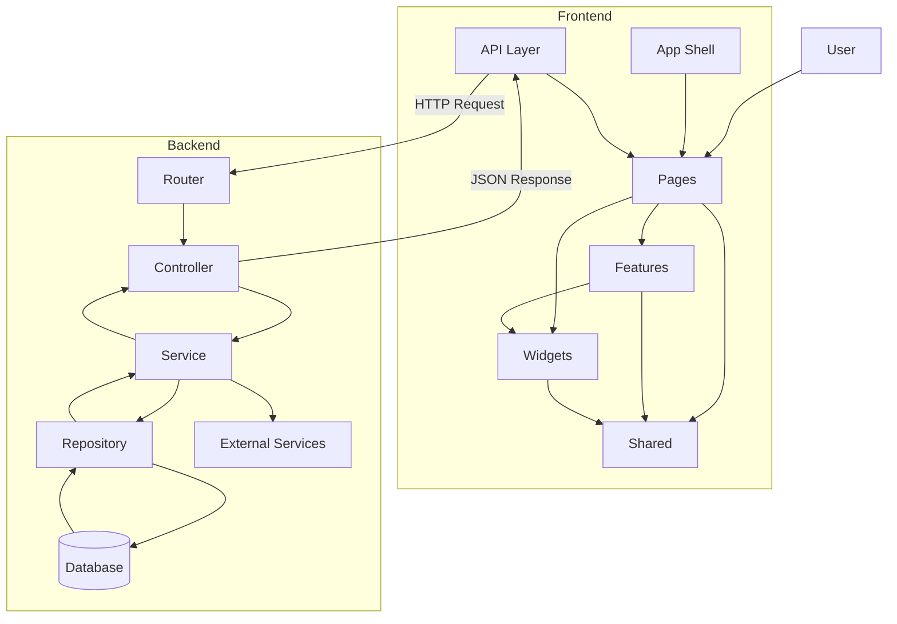

# MovieMon

[](LICENSE)
[](https://nodejs.org/)
[](https://vitejs.dev/)
[](https://react.dev/)

MovieMon is a open-source movie discovery and personal library experience that helps users explore large catalogs, apply rich filters, and keep track of what they want to watch or have already watched. It focuses on fast exploration, clean UX, and scalable data flow for long‑term product growth.

---

## Live

[https://moviemon.netlify.app](https://moviemon.netlify.app)

---

## Highlights

* Discover movies fast with search, filters, trending lists, and infinite scroll
* Personal library features for saved, watch later, and watch history
* Media playback with subtitle support for a complete viewing experience
* Clear loading, empty, and error states for smooth UX
* Responsive, performance‑minded UI built for long sessions

---

## Tech Stack

**Client**

* React 19 + Vite
* React Router
* TanStack Query
* Tailwind CSS
* MUI (Material UI)
* Framer Motion
* Swiper
* HLS.js + Plyr
* Lottie

**Server**

* Node.js + Express
* MongoDB + Mongoose
* JWT auth + bcrypt
* Multer (uploads) + Cloudinary
* EmailJS (email flows)
* Helmet, CORS, Morgan
* Winston logging

**Tooling**

* ESLint (boundaries + import rules)
* Jest + Supertest + mongodb-memory-server

---

## Architecture & Data Flow (High Level)

MovieMon follows a feature-based structure inspired by FSD principles, with strict layer boundaries enforced by ESLint. The goal is a clear, predictable dependency graph and a clean separation between app shell, domain features, and shared primitives.

Frontend folders in `client/src`:

* `app`: App shell (root layout, providers, routing)
* `pages`: Route-level screens (orchestrate features and widgets)
* `features`: Domain logic grouped by feature (no cross-feature imports)
* `widgets`: Feature-aware compositions used by pages/features
* `shared`: Global UI primitives, hooks, utils, data, assets, styles

Backend folders in `server/src`:

* `modules`: Feature modules (controller ? service ? repository)
* `app`, `config`, `middlewares`, `shared`, `tests`



---

## Frontend Access Rules (Enforced by ESLint)

* `app` is the shell and should be the top of the tree.
* `pages` can access: `features`, `widgets`, and `shared`.
* `features` can access: `widgets` and `shared`.
* `widgets` can access: `features` and `shared`.
* `shared` must not import from `features`, `widgets`, `pages`, or `app`.
* No cross-feature imports inside `features`.

These rules are enforced via ESLint (`eslint-plugin-boundaries` and `import/no-restricted-paths`).

---

## Getting Started

### Prerequisites

* Node.js >= 18
* npm >= 9

### Install

```bash
# from repo root
cd client
npm install

cd ../server
npm install
```

### Environment Variables

Create `.env` files as needed. Only include the variables your deployment requires.

**Client (`client/.env`)**

```bash
VITE_SERVER_BASE_URL=http://localhost:3000
VITE_HLS_PROXY_URL=http://localhost:3000
```

**Server (`server/.env`)**

```bash
NODE_ENV=development
PORT=3000
MONGO_URI=...
JWT_SECRET=...
JWT_EXPIRES_IN=7d
LOG_LEVEL=info

MOVIES_API_PROVIDER=tmdb
MOVIES_API_BASE_URL=...
MOVIES_API_KEY=...

OPEN_SUBTITLES_API_BASE_URL=...
OPEN_SUBTITLES_API_KEY=...
OPEN_SUBTITLE_USERNAME=...
OPEN_SUBTITLE_PASSWORD=...

SUBDL_API_BASE_URL=...
SUBDL_API_KEY=...
SUBTITLES_API_KEY_MODE=bearer

EMAILJS_SERVICE_ID=...
EMAILJS_TEMPLATE_ID=...
EMAILJS_PUBLIC_KEY=...
EMAILJS_PRIVATE_KEY=...

APP_BASE_URL=...
```

### Run Locally

```bash
# terminal 1
cd server
npm run dev

# terminal 2
cd client
npm run dev
```

---

## API Overview

Base URL: `/api`

**Health**
* `GET /api/health`

**Auth**
* `POST /api/auth/register`
* `POST /api/auth/login`
* `GET /api/auth/verify`
* `POST /api/auth/verify/resend`
* `GET /api/auth/email-change/approve`
* `POST /api/auth/password/forgot`
* `POST /api/auth/password/reset`

**Movies**
* `GET /api/movies/video-src`
* `GET /api/movies/*` (proxy to provider)

**Subtitles** (requires auth)
* `GET /api/subtitles/list/:mediaId`
* `GET /api/subtitles/file/:mediaId`

**Users**
* `PATCH /api/users/me` (auth, multipart avatar)
* `DELETE /api/users/me` (auth)
* `GET /api/users/saved` (auth)
* `GET /api/users/watchlater` (auth)
* `GET /api/users/watch-history` (auth)
* `POST /api/users/saved/:movieId` (auth)
* `POST /api/users/watchlater/:movieId` (auth)
* `POST /api/users/watch-history/:movieId` (auth)

---

## Scripts

**Client** (`client/package.json`)

* `npm run dev` — start Vite dev server
* `npm run build` — production build
* `npm run preview` — preview production build
* `npm run lint` — lint codebase

**Server** (`server/package.json`)

* `npm run dev` — start server with nodemon
* `npm start` — start server
* `npm test` — run tests

---

## Roadmap

* Comprehensive test coverage for client and server
* Pagination for user library endpoints and UI
* Server‑side HLS pipeline implementation
* Entity layer separation for stricter FSD alignment

---

## Contributing

Please see [CONTRIBUTING](CONTRIBUTING.md) for guidelines.

---

## License

MIT License. See `LICENSE` for details.

---

## Connect

* Portfolio: https://developer-rayhan.netlify.app
* GitHub: https://github.com/rayhan5497
