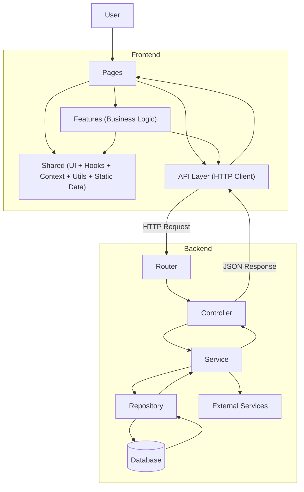

# 🎬 MovieMon v2

**React + Vite App for browsing movies** using TMDB API, built with component-driven architecture and performance in mind. Designed for educational purposes to demonstrate React, API integration, and component reuse.

---

## 🔗 Live Demo

[https://moviemon-v2.vercel.app](https://moviemon-v2.netlify.app)

## 📦 Repository

[https://github.com/rayhan5497/moviemon-v2](https://github.com/rayhan5497/moviemon-v2)

---

## 🚀 Features

* Browse movies with **search, filters, and infinite scrolling**
* Built with **React (Hooks, functional components) + Vite**
* **Component-driven architecture** with reusable UI logic
* Handles **async data fetching**, loading states, and error cases gracefully
* Focused on **performance, UX, and maintainable code structure**

---

## 🛠️ Tech Stack

* **Frontend:** React, JavaScript (ES6+), HTML5, CSS3 (custom utilities), Tailwind CSS
* **Backend:** Node JS, Express
* **API:** TMDB API

---

## 💡 Learning Highlights

* Implemented **infinite scroll and API pagination**
* Managed **loading/error states** effectively
* Learned **component reuse patterns** in React
* Explored **state management without external libraries**

---

## 🏗 Architecture & Data Flow

---

## 🤝 Connect

* Portfolio: [https://developer-rayhan.netlify.app](https://developer-rayhan.netlify.app)
* GitHub: [https://github.com/rayhan5497](https://github.com/rayhan5497)
